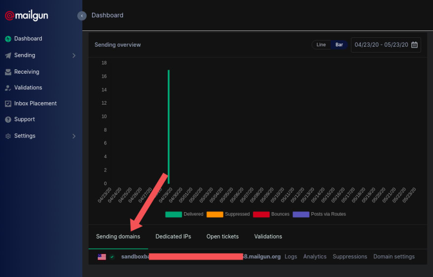

# NodeJS Nodemailer Mailgun
Sending an email using nodemailer

### Installation
`npm install`

### Configure .env
`cp .env.example .env`

#### Signup Mailgun
1. Create a Mailgun account at https://www.mailgun.com
2. Once the account has created, scroll down to the bottom of the dashboard page where you'll see sending domain, copy the domain address and paste as `MAILGUN_SANDBOX_DOMAIN` in .env.

3. On the right-hand side of the page, click on the API keys. Click the eye icon to reveal the Private API key, copy and paste as `MAILGUN_PRIVATE_API_KEY` in .env.

4. Go back to the sandbox domain address and click on the domain link. Add a recipient email address and verify it. Then, configure as `RECIPIENT_EMAIL` in .env.

#### Run the server
`node index.js`

#### Contact Us Form
Visit http://localhost:8080 in a browser.

